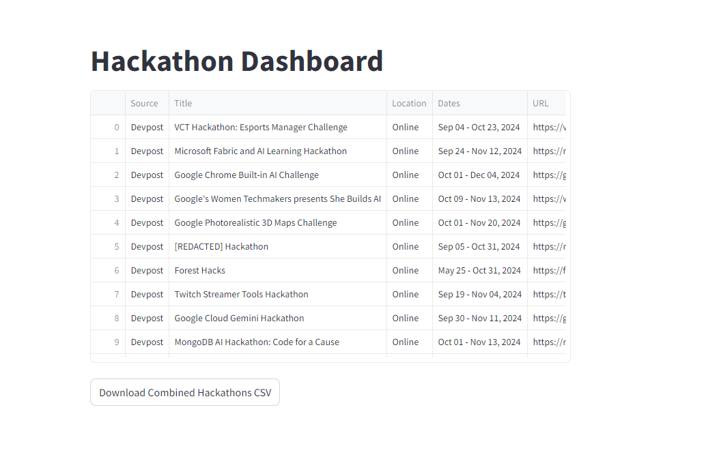

# Hackathon Dashboard



## Overview

The Hackathon Dashboard is a web application designed to scrape hackathon information from various sources such as Devpost, Devfolio, and MLH, consolidating the data into a single, user-friendly interface. This project aims to make it easier for developers and enthusiasts to find and participate in upcoming hackathons.

## Technologies Used

- **Web Scraping**: The application utilizes Python along with various scraping tools and packages to gather data from different platforms.
- **User Interface**: Built using [Streamlit](https://streamlit.io/), allowing for an interactive and responsive UI.
- **Scheduler**: Future implementations may include schedulers like Apache Airflow or Mage AI to automate data scraping and updating processes.

## Getting Started

To run the Hackathon Dashboard locally, follow these steps:

1. Clone the repository:
   ```bash
   git clone https://github.com/mozartco/hackathon_dashboard.git

2. Change directory:
    ```bash
    cd src

3. Run streamlit app:
    ```bash
    streamlit run scrape.py